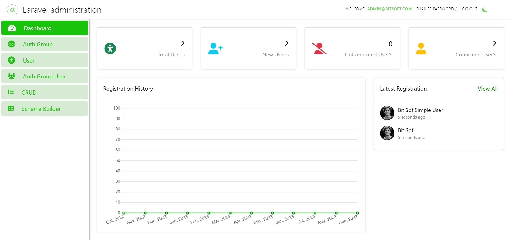

# ⚡ Laravel Admin Generator



[](https://packagist.org/packages/bitsoftsol/laravel-administration)
[](https://packagist.org/packages/bitsoftsol/laravel-administration)
[](https://opensource.org/licenses/MIT)
[](https://php.net)
[](https://laravel.com)

> **Stop writing repetitive CRUD code. Let Laravel Admin Generator do it for you.**

A powerful Laravel package that **automatically generates** a full-featured Admin Panel, CRUD operations, and RESTful APIs — just by adding a trait to your model. No boilerplate. No repetition. Just results.

---

## ✨ Why Laravel Admin Generator?

Most Laravel projects waste days building the same admin panels over and over. This package eliminates that entirely.

| Without This Package          | With Laravel Admin Generator       |
| ----------------------------- | ---------------------------------- |
| Write controllers manually    | ✅ Auto-generated controllers      |
| Build CRUD views from scratch | ✅ Auto-generated Blade views      |
| Define API routes one by one  | ✅ RESTful APIs auto-registered    |
| Setup auth & roles yourself   | ✅ Built-in auth & role management |
| Hours of repetitive work      | ✅ Running in minutes              |

---

## 🚀 Features

- ⚡ **Automatic CRUD Generation** — Full Create, Read, Update, Delete out of the box
- 🔌 **RESTful API Generation** — Auto-registered API endpoints for every model
- 🏗️ **Visual Schema Builder** — Create models & migrations from the browser UI
- ✏️ **Live Code Editor** — Edit model and migration files directly in the browser
- 🔐 **Authentication & Role Management** — Built-in user auth with role-based access
- 🖼️ **Image Field Support** — Automatic file upload handling (suffix field with `_image`)
- 📦 **Postman Collection Included** — Ready-to-use API collection for instant testing
- 🎨 **Clean Admin UI** — Modern, responsive dashboard out of the box

---

## 📦 Installation

### Step 1 — Create Laravel Project

```bash
composer create-project laravel/laravel my-project
cd my-project
```

### Step 2 — Install Package

```bash
composer require bitsoftsol/laravel-administration
```

### Step 3 — Register Service Provider

In `config/app.php`, add to the `providers` array:

```php
Bitsoftsol\LaravelAdministration\LaravelAdminServiceProvider::class,
```

### Step 4 — Publish Vendor Files

```bash
php artisan vendor:publish
# Select LaravelAdminServiceProvider when prompted
```

### Step 5 — Install Frontend Assets

```bash
npm install && npm run dev
```

### Step 6 — Configure Database

Set your database credentials in `.env`:

```env
DB_DATABASE=your_database
DB_USERNAME=your_username
DB_PASSWORD=your_password
```

### Step 7 — Run Migrations & Seed

```bash
php artisan migrate --seed
```

### Step 8 — Enable Auth Routes

In `routes/web.php`:

```php
Auth::routes();
```

### Step 9 — Serve & Access

```bash
php artisan serve
```

Visit: `http://127.0.0.1:8000/admin`

**Default Login:**

```
Email:    admin@bitsoftsol.com
Password: bitsoftsol123
```

### Step 10 — Create Your Superuser

```bash
php artisan createsuperuser
```

Follow the prompts to set username, email, and password.

---

## 🛠️ Usage — Auto CRUD in 3 Steps

Let's say you want full CRUD for a `Seller` model:

**Step 1 — Generate Model & Migration**

```bash
php artisan make:model Seller -m
```

**Step 2 — Add Traits to Your Model**

```php
<?php

namespace App\Models;

use Illuminate\Database\Eloquent\Model;
use Bitsoftsol\LaravelAdministration\Traits\LaravelAdmin;
use Bitsoftsol\LaravelAdministration\Traits\LaravelAdminAPI;

class Seller extends Model
{
    use LaravelAdmin;      // Enables web CRUD panel
    use LaravelAdminAPI;   // Enables REST API endpoints

    protected $fillable = [
        'name',
        'email',
        'city',
        'country',
        'profile_image'   // _image suffix = auto file upload
    ];
}
```

**Step 3 — Run Migration**

```bash
php artisan migrate
```

✅ **That's it.** Visit `/admin` — your full CRUD panel is ready. APIs are live too.

---

## 🌐 Auto-Generated REST APIs

Once `LaravelAdminAPI` trait is added, these endpoints are automatically available:

| Method   | Endpoint                          | Description       |
| -------- | --------------------------------- | ----------------- |
| `POST`   | `/api/admin/login`                | Authentication    |
| `GET`    | `/api/admin/crud/models`          | List all models   |
| `GET`    | `/api/admin/crud/{model_id}`      | List records      |
| `GET`    | `/api/admin/crud/{model_id}/{id}` | Get single record |
| `POST`   | `/api/admin/crud/{model_id}`      | Create record     |
| `PUT`    | `/api/admin/crud/{model_id}`      | Update record     |
| `DELETE` | `/api/admin/crud/{model_id}/{id}` | Delete record     |

📬 **Postman Collection included** — import and test instantly:
[Download Collection](src/readme-assets/postman/Laravel-Administration.postman_collection.json)

---

## 🏗️ Visual Schema Builder

Prefer a GUI? Use the built-in Schema Builder — no terminal needed.

1. Visit `http://127.0.0.1:8000/admin/crud-schema/create`
2. Enter your model name (e.g. `Product`)
3. Define fields visually — add columns, set types, enable image upload
4. Click **Migrate** — table created, CRUD panel live instantly

**Live Code Editor** — click "Open Editor" on any schema to edit migration and model files directly in the browser before migrating.

---

## 🔐 Authentication & Roles

Laravel Admin Generator ships with a complete auth system:

- Secure login with session management
- Role-based access control (Admin, Superuser)
- `createsuperuser` artisan command for quick setup
- Middleware-protected admin routes out of the box

---

## 📋 Requirements

| Requirement | Version     |
| ----------- | ----------- |
| PHP         | 8.0+        |
| Laravel     | 10.x / 11.x |
| MySQL       | 5.7+ / 8.x  |
| Node.js     | 16+         |

---

## 🗺️ Roadmap

- [ ] Multi-language / localization support
- [ ] Custom theme builder
- [ ] Excel / CSV import-export per model
- [ ] API rate limiting controls
- [ ] SaaS multi-tenancy support

---

## 📬 Contact & Hire Me

I'm available for freelance and contract projects. If you need a custom POS system, e-commerce backend, REST API, or any Laravel/Vue.js application — let's talk.

| | |
|---|---|
| 📧 **Email** | [alikashi54321@gmail.com](mailto:alikashi54321@gmail.com) |
| 💼 **LinkedIn** | [linkedin.com/in/kashif-ali-39659518a](https://www.linkedin.com/in/kashif-ali-39659518a) |
| 🌐 **Portfolio** | [kashifali-laraveldev.kitsoftsol.com](http://kashifali-laraveldev.kitsoftsol.com) |
| 📱 **WhatsApp / Phone** | [+92 305 750 2419](https://wa.me/923057502419) |

---

> *Built with ❤️ by Kashif Ali — Laravel Developer*
